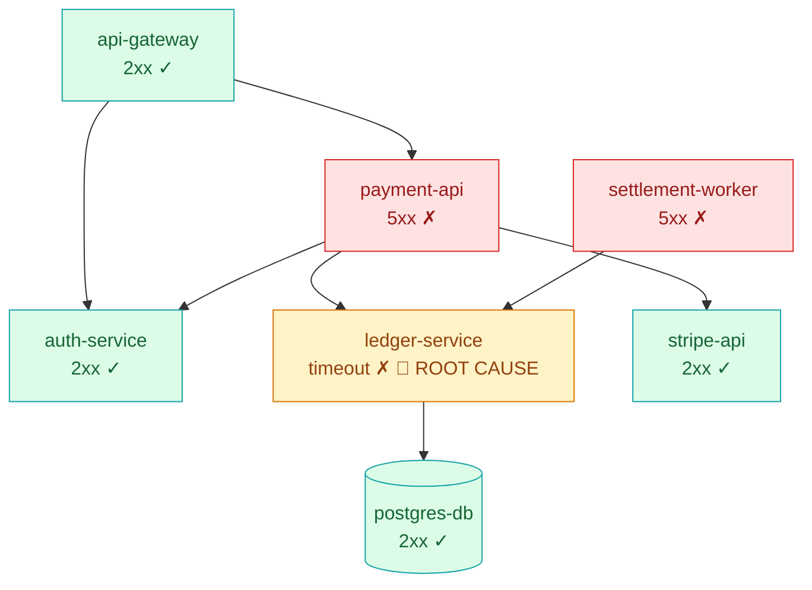
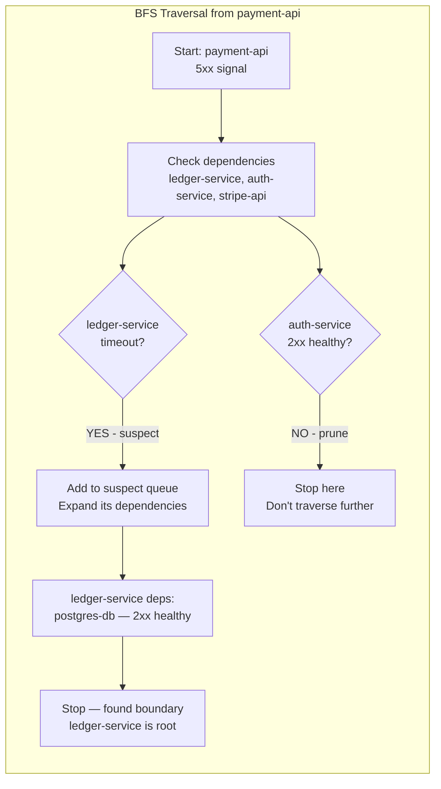
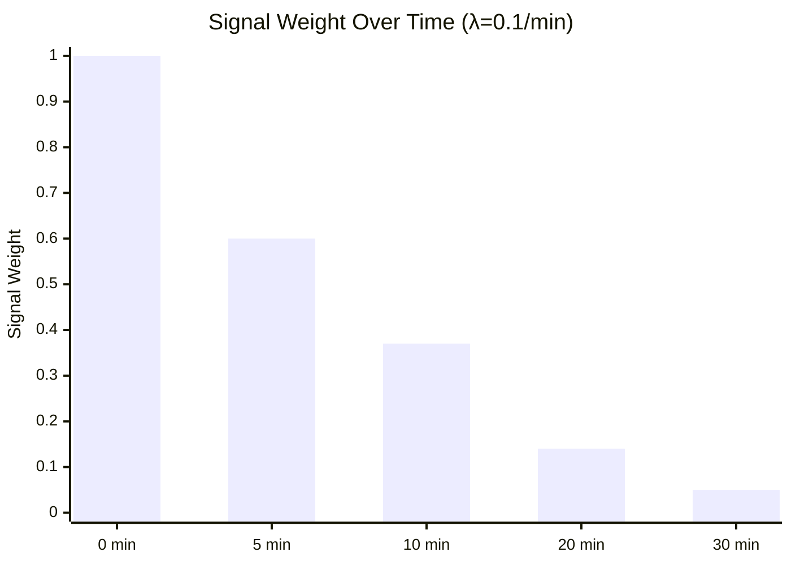
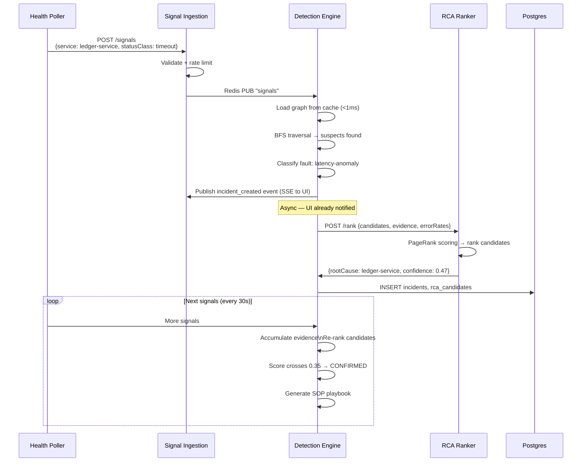
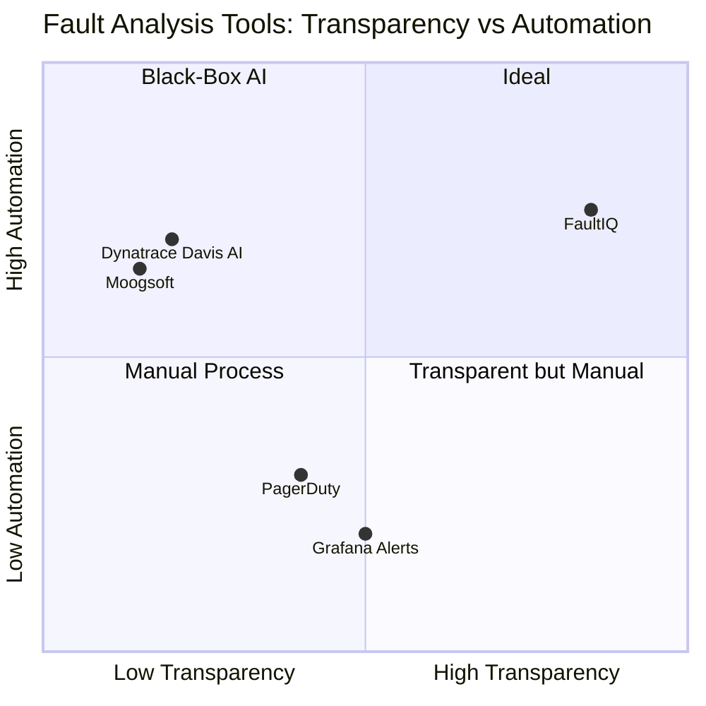

# We Built an Open-Source Alternative to Dynatrace AIOps — Here's How the Root Cause Algorithm Works

> **TL;DR:** We open-sourced FaultIQ — a graph-based fault analysis engine that uses BFS traversal, PageRank-style evidence propagation, and a structured SOP state machine to automatically find the root cause of distributed system failures and guide remediation. It's free, self-hosted, and the algorithm is fully transparent.

---

## The Problem With Every Monitoring Tool You're Using

You have Datadog, or Grafana, or New Relic. Your services are instrumented. When something breaks, alerts fire.

Here's what happens when `ledger-service` times out in a payment platform with 10 microservices:

```
🔴 ALERT: payment-api — error rate 18%
🔴 ALERT: settlement-worker — error rate 31%
🔴 ALERT: ledger-service — timeout
🔴 ALERT: api-gateway — elevated latency
```

Four separate alerts. Four separate Slack notifications. Four separate PagerDuty pages.

Your on-call engineer wakes up at 3 AM, looks at four red dashboards, and spends 45 minutes manually tracing dependency paths to figure out that **all four alerts came from one single failure**: `ledger-service` was slow, and everything upstream of it cascaded.

This is the fundamental problem with threshold-based alerting: **it fires per service in isolation, with no understanding of causality**.

---

## Why This Happens: The Cascade Problem

When `ledger-service` times out, here's what actually happens through your call graph:



Notice what's happening:
- `ledger-service` is timing out → it's the **source**
- `payment-api` fails because it calls `ledger-service` → it's a **victim**
- `settlement-worker` fails for the same reason → also a **victim**
- `auth-service` and `stripe-api` are completely unaffected → **healthy**

Every monitoring tool fires separate alerts for `payment-api`, `settlement-worker`, and `ledger-service`. **None of them tell you which is the root cause.** That's the job your on-call engineer is doing manually at 3 AM.

---

## The Algorithm: Graph Traversal + Evidence Accumulation

FaultIQ solves this with a two-part approach:

### Part 1: BFS Traversal With Pruning

When a fault signal arrives for `payment-api`, we don't alert immediately. We run a Breadth-First Search across the service dependency graph:



The key insight: **healthy nodes prune the search**. When we hit `auth-service` (healthy 2xx), we stop traversing that branch. When we hit `ledger-service` (timeout), we expand it. This converges quickly on the actual root.

### Part 2: Evidence Accumulation With Time Decay

A single bad health check doesn't create an incident. That's alert fatigue. Instead, FaultIQ accumulates evidence across multiple signals and applies **exponential time decay**:



A signal from 30 minutes ago contributes only 5% to the confidence score. A signal from 2 minutes ago contributes 82%. **Stale evidence decays automatically** — the system won't stay triggered because of a blip that happened an hour ago.

The confidence formula:

```
score = (Σ decay(signal_i) / 5.0) × 0.40   ← time-decayed evidence
      + (failing_callers / total_nodes)  × 0.35   ← blast radius (PageRank-style)
      + error_rate                       × 0.10   ← observed error rate
```

When the score crosses **0.35** (calibrated for a typical 10-node graph), we confirm the root cause.

---

## The Full Detection Pipeline



**Key performance characteristic:** The detection event is published to the UI *before* the database write. The operator sees the incident in under 5ms from signal receipt. The DB write, RCA ranking, and playbook generation happen asynchronously.

---

## How It Compares to Existing Tools



Dynatrace Davis AI is highly automated but opaque — when it's wrong, you can't understand why. FaultIQ shows you **every decision**:

```json
{
  "event": "root_cause_confirmed",
  "score": 0.474,
  "reasoning": "evidence(7 signals, decayed)×0.40 + propagation(2/10 callers)×0.35 + errorRate(0.42)×0.10 = 0.474 ≥ threshold 0.35",
  "bfs_path": "api-gateway → payment-api → ledger-service (root)"
}
```

This is the reasoning chain that every decision produces. Machine-parseable JSON, stored in Postgres, queryable via API.

---

## Getting Started

```bash
git clone https://github.com/[your-org]/FaultIQ
cd FaultIQ
cp .env.example .env
docker compose up --build
# Open http://localhost:4001
```

Or try the demo in 3 commands without installing anything — see [docs/LOCAL_DEMO.md](../docs/LOCAL_DEMO.md).

**GitHub:** [github.com/your-org/FaultIQ](https://github.com/your-org/FaultIQ)  
**License:** Apache 2.0

---

*In the next post, we go deeper on the BFS algorithm and show how graph topology affects which service gets identified as root cause across different failure patterns.*
