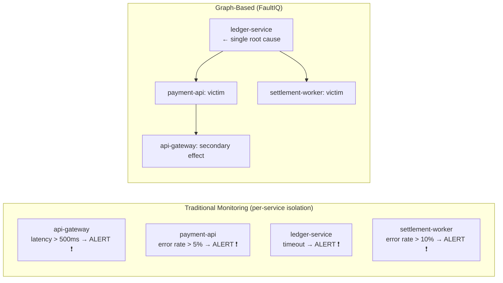
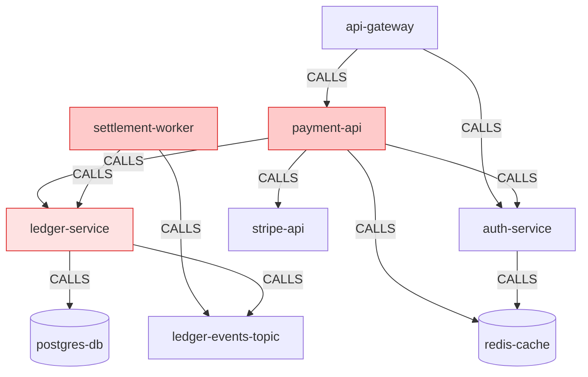
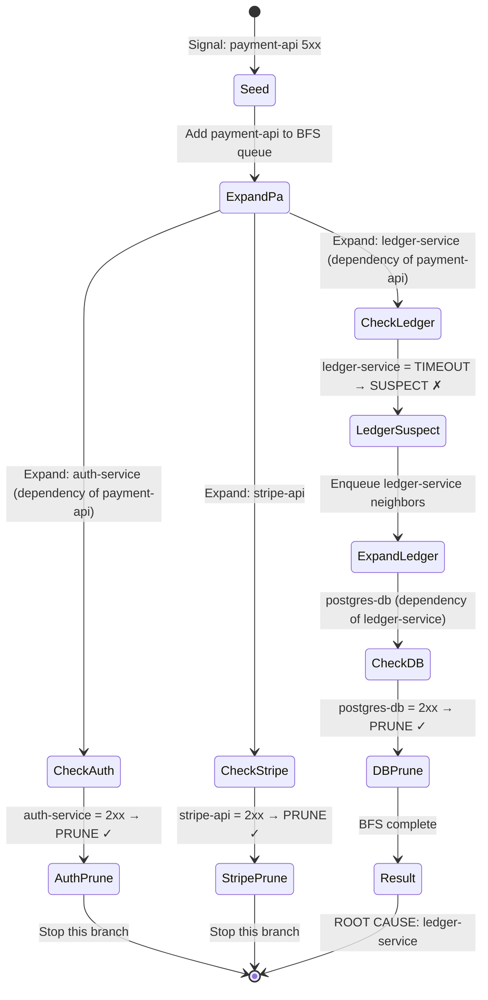
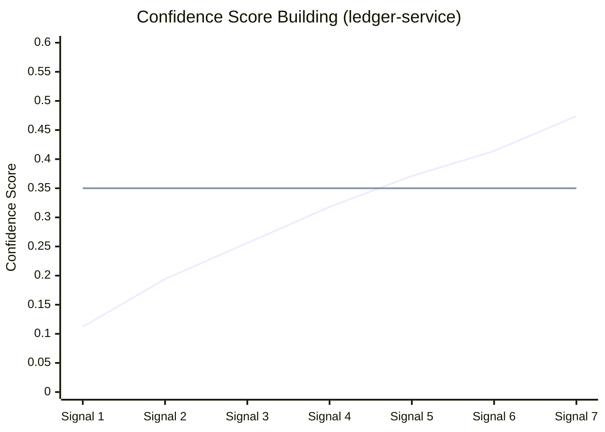
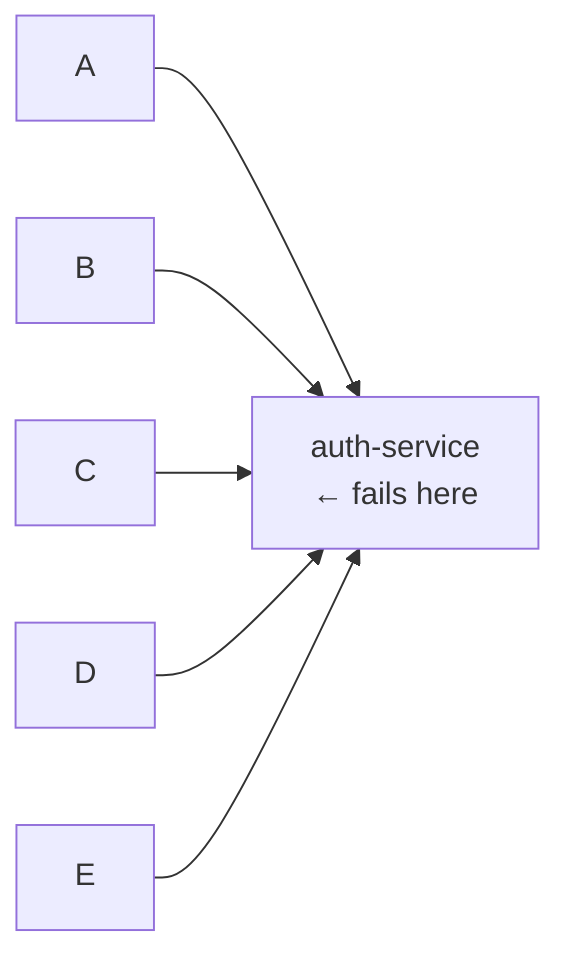
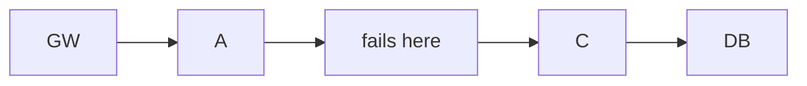
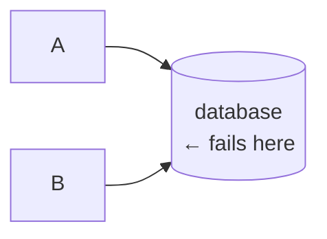

# Why Monitoring Tools Fire 5 Alerts for the Same Failure — And How Graph Traversal Fixes It

> **Audience:** SREs, platform engineers, and anyone who's been paged at 3 AM by a cascade of alerts that all traced back to one service.

---

## Five Alerts. One Root Cause. Zero Clarity.

Here's a real scenario from a payments platform. 14:23 on a Tuesday. Five PagerDuty pages fire within 90 seconds:

| Time | Service | Alert |
|------|---------|-------|
| 14:23:01 | `ledger-service` | P95 latency > 3000ms |
| 14:23:12 | `payment-api` | Error rate > 5% |
| 14:23:18 | `settlement-worker` | Error rate > 10% |
| 14:23:31 | `api-gateway` | 95th percentile latency spike |
| 14:23:45 | `ledger-service` | Error rate > 40% |

Your on-call engineer is looking at five separate dashboards. Each one says "something is wrong here." None of them say "ledger-service caused everything else."

The engineer spends 30-45 minutes:
1. Correlating timestamps across dashboards
2. Tracing the call graph in their head (or a whiteboard)
3. Figuring out that `payment-api` started failing 11 seconds *after* `ledger-service` slowed down
4. Concluding the root cause was `ledger-service`

**This is cognitive work the computer should be doing.**

---

## Why Threshold-Based Alerting Cannot Solve This

Threshold alerting is simple: metric X > value Y → page someone. The problem isn't the threshold — it's the **unit of analysis**.

Every monitoring tool evaluates services *independently*:



The traditional approach has no concept of "this service failed *because* that service failed." Each service is evaluated in a vacuum.

---

## The Call Graph Is the Missing Context

Your services don't exist in isolation. They call each other. That call graph encodes **causality**:



When `ledger-service` times out, every service that calls it will start failing. The graph tells us who those are.

---

## BFS Traversal: How FaultIQ Finds the Root

When a fault signal arrives, FaultIQ runs a **Breadth-First Search** starting from the reporting service.

Let's trace through what happens when `payment-api` reports a 5xx signal:



**Three rules drive the traversal:**

1. **5xx/timeout node** → add to suspects, expand its dependencies
2. **2xx healthy node** → prune this branch entirely  
3. **Depth limit** (default 5 hops) → stop to prevent infinite loops in cyclic graphs

The healthy nodes act as **circuit breakers** in the traversal. Because `auth-service`, `postgres-db`, and `stripe-api` are all healthy, those branches terminate immediately. The only path that keeps expanding is `ledger-service`.

---

## The Blast Radius Direction Matters

Here's something subtle: we traverse **both directions** in the graph.

Forward edges: `payment-api → ledger-service` (payment-api calls ledger-service)
Reverse edges: `settlement-worker → ledger-service` (settlement-worker also calls ledger-service)

```mermaid
flowchart TD
    subgraph Forward["Forward: payment-api depends on ledger-service"]
        PA2[payment-api] -->|calls| LS2[ledger-service]
    end
    subgraph Reverse["Reverse: who else calls ledger-service?"]
        LS3[ledger-service] <--|called by| SW2[settlement-worker]
    end
    subgraph Result["Result: full blast radius"]
        LS4[ledger-service\nROOT] 
        PA3[payment-api\nvictim]
        SW3[settlement-worker\nvictim]
        LS4 -.->|causes failure in| PA3
        LS4 -.->|causes failure in| SW3
    end
```

When we find `ledger-service` as a suspect, we also check its reverse edges — who else calls it. Both `payment-api` and `settlement-worker` call `ledger-service`. This gives us the **blast radius**: the full set of services affected by this one failure.

---

## Real vs. Noise: Why Evidence Matters More Than One Signal

BFS traversal identifies *candidates*. But a single bad health check shouldn't immediately root cause a service. That would create false positives on transient blips.

Instead, FaultIQ accumulates evidence across multiple signals before committing to a root cause:



At signal 7, confidence (0.474) crosses the threshold (0.35) → **CONFIRMED**.

The confidence uses three inputs weighted by their signal quality:
- **Evidence signals** (40%) — count of signals, weighted by freshness
- **Propagation score** (35%) — how many failing callers depend on this node
- **Error rate** (10%) — the observed error rate from signals

The propagation score is the PageRank-inspired part: a service that is called by many *already-failing* services scores higher. `ledger-service` is called by 2 failing services (`payment-api` and `settlement-worker`) out of 10 total → propagation = 0.20.

---

## What Changes for Different Topologies

Different service graphs produce different root cause outcomes. Understanding this helps you set up your topology correctly.

**Hub node failure** (one service called by many):



Auth-service has 5 callers → propagation score = 5/10 = 0.50. High blast radius → confidence rises fast. Good.

**Deep chain failure** (failure in middle of a call chain):



Only `A` directly calls `B`. Propagation = 1/5 = 0.20. Confidence rises slower — needs more signals to confirm. Expected behavior.

**Leaf node failure** (database, external API):



Databases have no callers (they're leaf nodes in the call graph). Propagation = 0. Confidence is driven entirely by direct signals. This means database failures need more evidence signals to confirm — which is correct, because a slow database doesn't mean it's the *root* cause (it could be a bad query from the service).

---

## Trying It Yourself

```bash
git clone https://github.com/[your-org]/FaultIQ
cd FaultIQ && cp .env.example .env
docker compose up --build

# See BFS in action — inject a fault and watch the logs:
curl -X PUT http://localhost:8091/admin/services/ledger-service/status \
  -H "Content-Type: application/json" \
  -d '{"statusClass":"timeout","errorRate":0.42,"latencyP95":4800}'

# Watch the reasoning in real time:
docker logs faultiq-detection-engine-1 -f | grep REASONING | python3 -m json.tool
```

You'll see the exact BFS traversal, confidence calculation, and phase transitions as structured JSON logs.

**GitHub:** [github.com/your-org/FaultIQ](https://github.com/your-org/FaultIQ)

---

*Next: how the SOP state machine takes over once the root cause is confirmed — the 7-phase pipeline that sequences the fix and auto-verifies recovery.*
