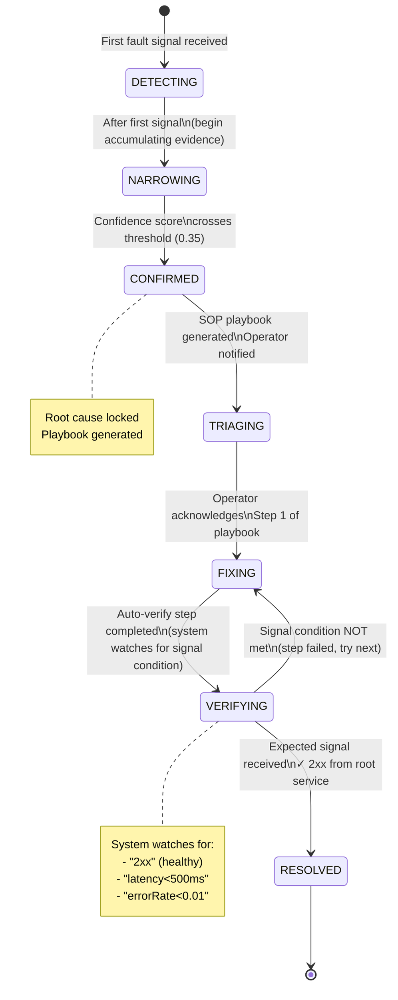
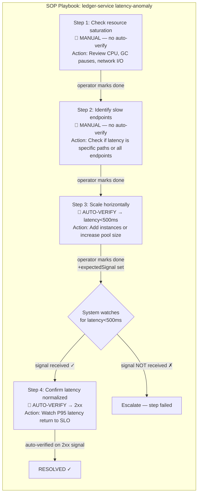
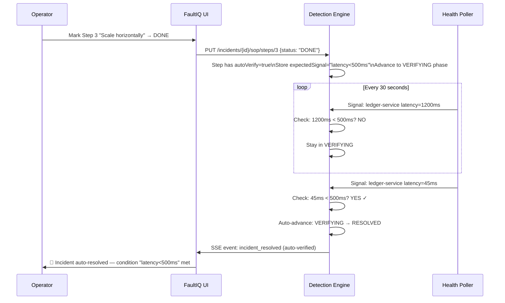
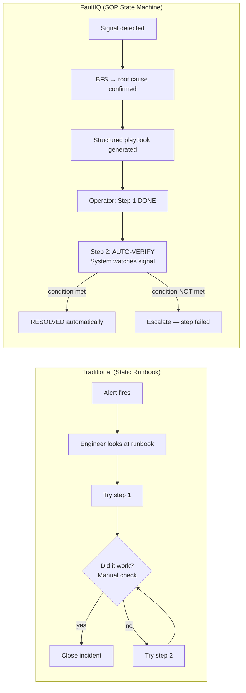

# The SOP State Machine: Incident Response That Auto-Verifies Its Own Fix

> **The insight:** Every other incident management tool gives you a ticket and a static runbook. FaultIQ gives you a living state machine — each remediation step has an expected outcome, and the system verifies the outcome happened before moving forward. No manual close. No "did the fix work?" guessing.

---

## The Problem With Runbooks

You have a runbook. It lives in Confluence or Notion. It says:

> **When payment-api returns 5xx:**  
> 1. Check if a deployment happened in the last 30 minutes  
> 2. Review application logs for new exception patterns  
> 3. Roll back deployment if correlated  
> 4. Monitor for 5 minutes to confirm recovery  

Runbooks are documents. They have no state. They don't know which step you're on. They don't know if step 3 actually worked. You have to manually decide "the error rate dropped, I'll close the incident."

What if the error rate *didn't* drop? The runbook doesn't tell you. You have to decide when to escalate, when to try something different, when to declare victory.

**This is the automation gap.** The knowledge of *what to do* is captured in the runbook. The verification of *whether it worked* is entirely manual.

---

## The SOP State Machine

FaultIQ replaces static runbooks with a 7-phase state machine where **every transition is driven by a real signal condition**:



The key innovation is the **VERIFYING** phase. After the operator marks a remediation step as complete, the system doesn't just trust that it worked. It watches incoming health signals for the *expected condition* — if `payment-api` should be healthy after a rollback, the system waits for `statusClass = "2xx"` from the health poller. When that signal arrives, it auto-resolves.

---

## What a SOP Playbook Looks Like

When root cause is confirmed (say, `ledger-service` with `latency-anomaly`), FaultIQ generates a structured playbook:



Steps 1 and 2 are **manual** — the operator needs to interpret logs and metrics. Steps 3 and 4 are **auto-verify** — the system confirms they worked by watching the health signals.

---

## The Signal-Condition Verification

The auto-verify mechanism is simple but powerful. Each step defines an `expectedSignal`:

| Step | expectedSignal | What it means |
|------|---------------|---------------|
| Restart service | `"2xx"` | Wait for next health poll to return HTTP 200 |
| Fix latency | `"latency<500ms"` | Wait for P95 latency signal under 500ms |
| Reduce error rate | `"errorRate<0.01"` | Wait for error rate below 1% |
| Scale up | `"latency<200ms"` | Stricter latency threshold after scaling |



**The operator doesn't have to manually check if the fix worked.** The health poller was already running every 30 seconds. FaultIQ just watches the existing signal stream for the expected condition. When it arrives, the incident closes itself.

---

## Phase Timeline: What You See in the UI

Here's the audit trail for a real incident from the test suite:

```mermaid
gantt
    title SOP Phase Timeline — inc-1788237390157
    dateFormat HH:mm:ss
    axisFormat %H:%M:%S

    section Automated
    DETECTING     :04:36:30, 2s
    NARROWING     :04:36:32, 118s
    CONFIRMED     :04:38:30, 1s
    TRIAGING      :04:38:31, 25m

    section Operator
    FIXING        :05:04:26, 17s

    section Automated
    VERIFYING     :05:04:43, 4m12s
    RESOLVED      :05:08:55, 1s
```



From first signal to CONFIRMED: **2 minutes** (7 signals accumulated).  
From CONFIRMED to RESOLVED after operator intervention: **30 minutes**.  
Without FaultIQ (manual investigation): typically **45-90 minutes**.

---

## Comparing to Existing Approaches



Three differences matter:

1. **No ambiguity about which step to try** — the playbook is generated from the confirmed fault type, not manually looked up
2. **No "did it work?" guessing** — the auto-verify condition makes success objective
3. **Automatic escalation on failure** — if the signal condition isn't met, FaultIQ escalates after the SLA window (default 30 min)

---

## The Audit Trail

Every phase transition and step action is recorded:

```sql
SELECT action, phase_from, phase_to, actor, created_at
FROM sop_audit WHERE incident_id = 'inc-xyz'
ORDER BY created_at;

--  action         | phase_from | phase_to  | actor           | created_at
-- ----------------+------------+-----------+-----------------+-----------
--  phase_change   | DETECTING  | NARROWING | system          | 10:57:20
--  phase_change   | NARROWING  | CONFIRMED | system          | 10:59:30
--  phase_change   | CONFIRMED  | TRIAGING  | system          | 10:59:30
--  step_done      | TRIAGING   | FIXING    | john@company.com| 11:04:26
--  step_done      | FIXING     | VERIFYING | john@company.com| 11:04:43
--  auto_resolved  | VERIFYING  | RESOLVED  | system          | 11:08:55
```

You have a complete record of: when each phase happened, who took each action, and what signal condition triggered auto-resolution. This is your compliance audit trail, MTTR measurement data, and retrospective evidence — all in one place.

---

## Building Your Own SOP Steps

You're not limited to the built-in playbooks. Define custom steps per service:

```yaml
# service-map.yaml
services:
  - id: svc_payment_api
    sopPlaybook:
      - order: 1
        title: "Check payment processor logs"
        action: "kubectl logs -n prod deployment/payment-api --since=10m | grep ERROR"
        autoVerify: false   # operator reads logs manually

      - order: 2  
        title: "Rollback to last stable version"
        action: "kubectl rollout undo deployment/payment-api -n prod"
        expectedSignal: "2xx"
        autoVerify: true    # system watches for 2xx from health poller
        
      - order: 3
        title: "Verify error rate normalized"
        action: "Watch error rate for 5 minutes"
        expectedSignal: "errorRate<0.005"
        autoVerify: true    # payment SLO is 0.5% — stricter than default
```

Custom playbooks are stored with version history — every update saves the previous version so you can revert to what worked before.

---

## Try It

```bash
git clone https://github.com/[your-org]/FaultIQ
cd FaultIQ && docker compose up --build

# See the full SOP state machine in action:
open http://localhost:4001/dashboard/demo
```

The demo page walks you through the entire flow — fault injection, phase progression, SOP steps, and auto-resolution — without needing a terminal.

**GitHub:** [github.com/your-org/FaultIQ](https://github.com/your-org/FaultIQ)

---

*Final post: how FaultIQ gets smarter with every incident — playbook learning and the data flywheel that makes it better than any static tool.*
