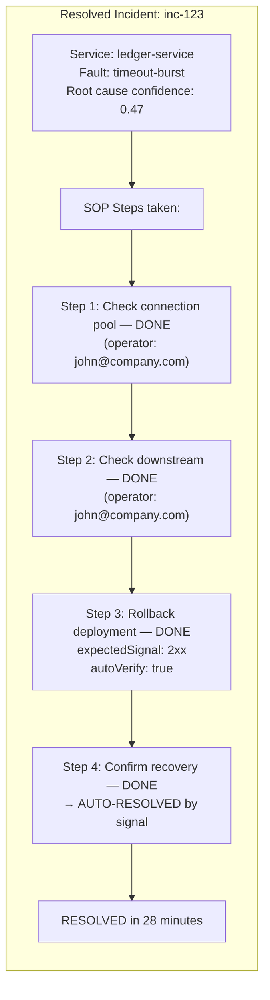
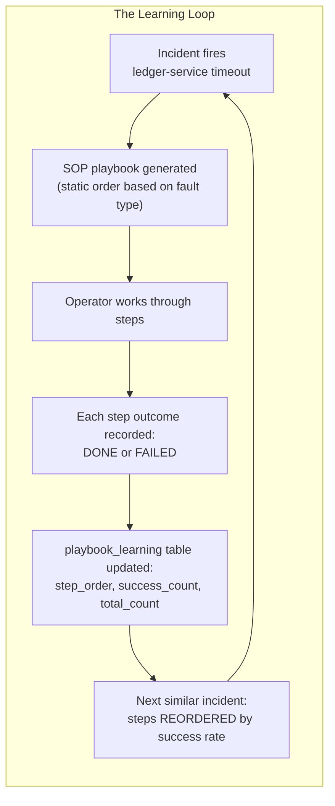
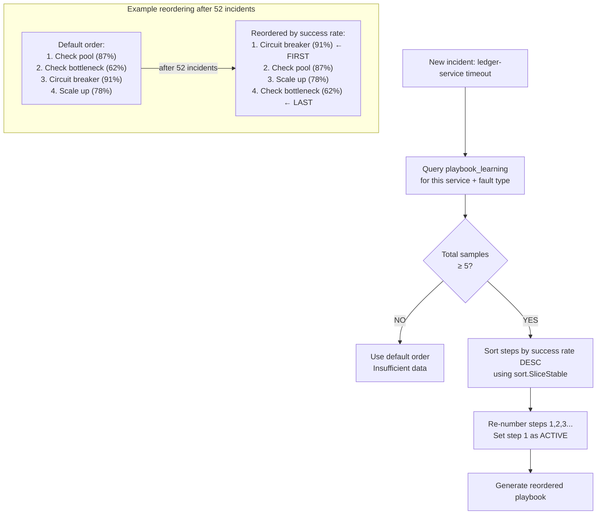
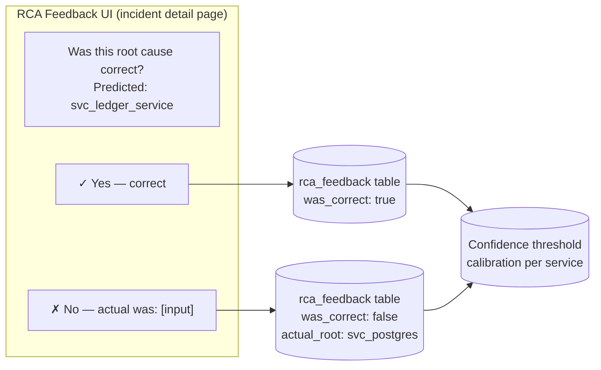
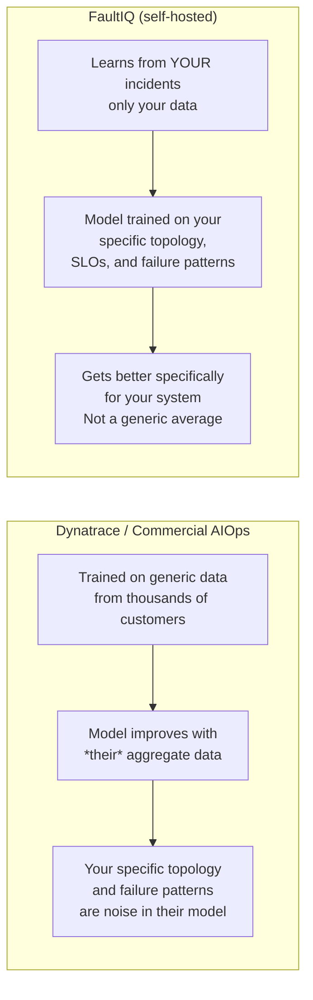
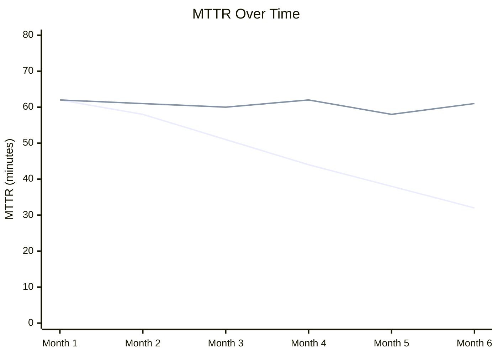

# Playbook Learning: How FaultIQ Gets Smarter With Every Incident

> **The problem with every SRE tool:** it's as dumb on day 365 as it was on day 1. The knowledge your team builds through every incident lives in runbook wikis, Slack threads, and individual engineers' heads. When that engineer leaves, the knowledge leaves with them. FaultIQ fixes this with a feedback loop that makes the system measurably better over time.

---

## The Knowledge Problem in Incident Response

Your team has been running production for two years. In those two years:

- You've learned that for *your* payment-service, the first thing to check is always the database connection pool — not the deployment logs (the runbook says check deployments first)
- You've learned that restarting the ledger-service alone is never enough — you also need to drain the retry queue
- You've learned that the notification-service is almost never the actual root cause, it's always a dependency

**None of this knowledge is in your monitoring tools.** It's in your runbooks, if you remember to update them. More likely, it's in your senior engineers' heads.

When you hire someone new, when your senior SRE goes on vacation, when you get paged at 3 AM for a service you've never touched — this accumulated knowledge is invisible.

---

## Where the Learning Data Is

Every time an incident is resolved, there's a complete record of exactly what happened:



After 50 incidents of `ledger-service` timeout, FaultIQ has a dataset: for each SOP step, how often did it lead to resolution? Which step was the tipping point?

---

## The Feedback Loop



The `playbook_learning` table stores outcomes per (service, fault_type, step_order):

```sql
SELECT service_id, fault_type, step_order, step_title,
       success_count, total_count,
       ROUND(100.0 * success_count / NULLIF(total_count, 0), 1) as success_rate
FROM playbook_learning
WHERE service_id = 'svc_ledger_service' AND fault_type = 'timeout-burst'
ORDER BY step_order;

--  service_id         | fault_type    | step_order | step_title                | success_rate
-- --------------------+---------------+------------+---------------------------+-------------
--  svc_ledger_service | timeout-burst |          1 | Check connection pool     | 87.5%
--  svc_ledger_service | timeout-burst |          2 | Identify bottleneck       | 62.0%
--  svc_ledger_service | timeout-burst |          3 | Enable circuit breaker    | 91.2%
--  svc_ledger_service | timeout-burst |          4 | Scale upstream service    | 78.4%
```

Step 3 (circuit breaker) has the highest success rate. Step 2 (identify bottleneck) is the weakest. On the next timeout incident for `ledger-service`, the playbook will reorder steps to put the high-success-rate ones first.

---

## How the Reordering Works

The reordering uses a **minimum sample size** of 5 incidents before changing the order. This prevents the system from reordering based on noise:



The result: **the step most likely to resolve the incident is shown first**. Operators work through fewer steps before the incident resolves. MTTR goes down over time without anyone updating a runbook.

---

## Operator Feedback Closes the Loop

Learning only happens if we know the outcome. FaultIQ collects two types of feedback:

**Implicit feedback** — step outcomes are automatically recorded when operators mark steps DONE or FAILED.

**Explicit feedback** — after an incident resolves, operators can confirm or deny the root cause prediction:



If the system predicted `ledger-service` but the actual root was `postgres-db`, that feedback is stored. Over time, the confidence scoring for your specific service topology can be tuned — services with weaker health signals need more evidence before confirmation.

---

## The Data Flywheel vs. Static Tools

This is the core competitive advantage of an open-source, self-hosted tool:



A commercial AIOps tool trained on thousands of customers' data will never know that *your* `ledger-service` timeout almost always requires draining the retry queue before the circuit breaker. FaultIQ learns exactly that, because it only trains on your incidents.

---

## What the Dashboard Shows

After 3-6 months of production usage, operators see learning badges on each SOP step:

```
┌─────────────────────────────────────────────────────────────┐
│ Step 1: Enable circuit breaker          ✓ 91% (47/52)       │
│ Action: Configure 50% failure threshold                      │
│ Expected: 2xx                           🤖 AUTO-VERIFY       │
├─────────────────────────────────────────────────────────────┤
│ Step 2: Check connection pool           ✓ 87% (45/52)       │
│ Action: Review pool utilization                              │
│                                         👤 MANUAL           │
├─────────────────────────────────────────────────────────────┤
│ Step 3: Scale upstream service          ⚠ 78% (41/52)       │
│ Action: Add instances                                        │
│ Expected: latency<500ms                 🤖 AUTO-VERIFY       │
├─────────────────────────────────────────────────────────────┤
│ Step 4: Identify downstream bottleneck  ⚠ 62% (3/5) LOW CONFIDENCE │
│ Action: Trace slow calls                                     │
│                                         👤 MANUAL           │
└─────────────────────────────────────────────────────────────┘
```

Step 4 shows "LOW CONFIDENCE" because it only has 5 samples. Step 1 shows 91% based on 52 incidents — that's a reliable signal.

---

## The Compounding Effect

Here's what happens to MTTR over time in a system that learns vs. one that doesn't:



The declining line is FaultIQ with learning enabled. The flat line is a static runbook system. The improvement isn't dramatic — it's incremental, 2-5 minutes per month — but it compounds. In month 6, the gap is 30 minutes per incident.

---

## Getting Started

```bash
git clone https://github.com/[your-org]/FaultIQ
cd FaultIQ && docker compose up --build

# After a few incidents, check learning data:
curl http://localhost:8080/api/v1/projects/proj-payments-prod/services/svc_ledger_service/playbook-learning \
  -H "Authorization: Bearer $TOKEN" | python3 -m json.tool
```

The API returns steps sorted by success rate descending, so you can see exactly what the system has learned and whether it makes sense for your specific failure patterns.

**GitHub:** [github.com/your-org/FaultIQ](https://github.com/your-org/FaultIQ)  
**License:** Apache 2.0 — free to use, modify, and self-host.

---

*This completes the four-part series on FaultIQ. The project is open source. Try it, break it, tell us what you find.*

---

## Series Index

1. [We Built an Open-Source Alternative to Dynatrace AIOps](01-open-source-dynatrace-alternative.md)
2. [Why Monitoring Tools Fire 5 Alerts for the Same Failure](02-graph-traversal-root-cause.md)
3. [The SOP State Machine: Incident Response That Auto-Verifies Its Own Fix](03-sop-state-machine.md)
4. **Playbook Learning: How FaultIQ Gets Smarter With Every Incident** ← you are here
