# FaultIQ — Architecture Guide

> All diagrams use Mermaid syntax. Render natively in GitHub, GitLab, Notion, VS Code, or [mermaid.live](https://mermaid.live)

---

## 1. System Context

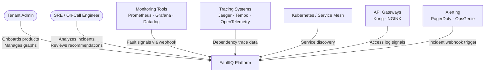

---

## 2. Container Architecture

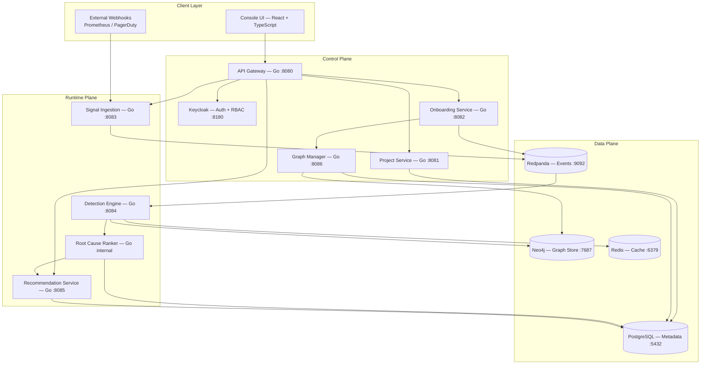

---

## 3. Tenant and Project Hierarchy

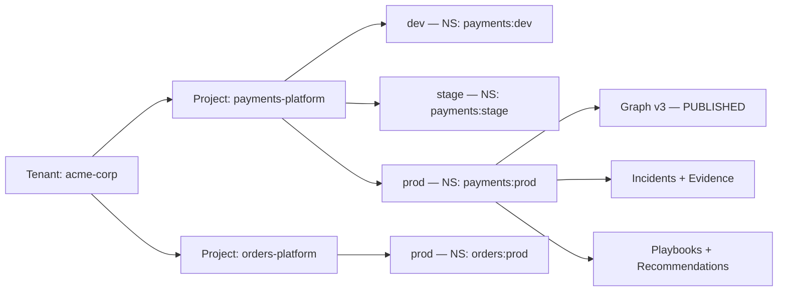

---

## 4. Dual-Graph Model

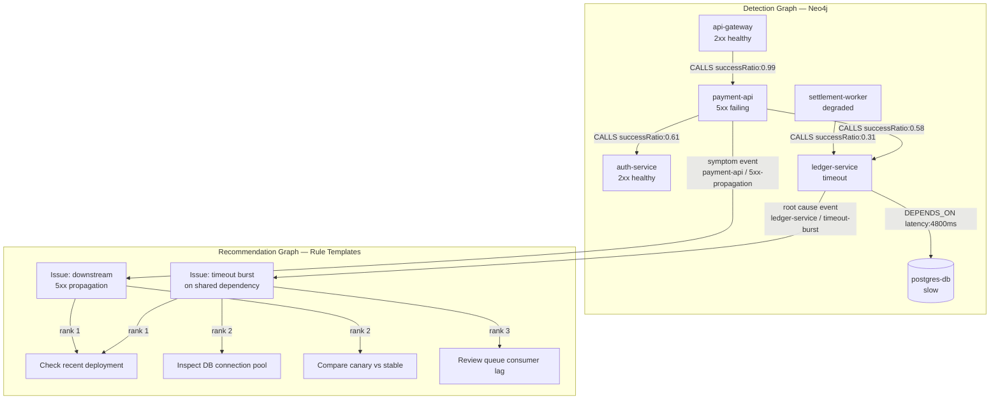

---

## 5. Product Onboarding — Sequence

```mermaid
sequenceDiagram
    actor Admin as Tenant Admin
    participant UI as Console UI
    participant GW as API Gateway
    participant ONB as Onboarding Service
    participant CONN as Connector Workers
    participant CAT as Service Catalog
    participant GM as Graph Manager
    participant NEO as Neo4j
    participant VAL as Graph Validator
    participant RP as Redpanda

    Admin->>UI: Create project (name, slug, environments)
    UI->>GW: POST /api/v1/tenants/{id}/projects
    GW-->>UI: 201 Created {projectId}

    Admin->>UI: Start onboarding (mode: hybrid, sources)
    UI->>GW: POST /api/v1/projects/{id}/onboarding/import
    GW->>ONB: Dispatch job (tenantId, projectId)
    ONB->>RP: Publish onboarding.started

    ONB->>CONN: Trigger connectors (OpenAPI + k8s + traces)
    CONN->>CONN: Parse specs and manifests
    CONN->>CAT: POST normalized services + dependency edges

    CAT->>CAT: Deduplicate, classify, confidence-score
    CAT->>GM: Build graph draft (nodes + edges)

    GM->>NEO: Write draft graph status=DRAFT
    GM->>VAL: Run validation checks

    VAL->>VAL: Check orphan nodes, missing edges,
low confidence, cycles
    VAL-->>UI: Return validation report

    Admin->>UI: Review graph, fix issues, approve
    UI->>GM: POST /api/v1/projects/{id}/graphs/publish

    GM->>NEO: Set graph status=PUBLISHED version++
    GM->>RP: Publish graph.published
    RP-->>UI: SSE — graph ready
```

---

## 6. Incident Analysis — Request-Response Cycle

```mermaid
sequenceDiagram
    actor MON as Prometheus Webhook
    participant SIG as Signal Ingestion :8083
    participant RP as Redpanda
    participant DET as Detection Engine :8084
    participant NEO as Neo4j :7687
    participant REDIS as Redis :6379
    participant RCA as Root Cause Ranker
    participant REC as Recommendation Service :8085
    participant PG as PostgreSQL
    actor OPS as SRE Operator

    MON->>SIG: POST /signals
{service:ledger-service, statusClass:timeout, errorRate:0.42}
    SIG->>SIG: Validate + enrich with tenantId/projectId
    SIG->>RP: Publish signals.fault.detected

    RP->>DET: Consume event

    DET->>REDIS: GET graph:payments-platform:prod
    alt Cache HIT
        REDIS-->>DET: Return adjacency list
    else Cache MISS
        DET->>NEO: MATCH subgraph WHERE namespace=payments:prod
        NEO-->>DET: Return nodes + edges
        DET->>REDIS: SET graph cache TTL 300s
    end

    DET->>DET: auth-service → 2xx + latency OK → PRUNE
    DET->>DET: payment-api → 5xx → SUSPECT HIGH
    DET->>DET: ledger-service → timeout → SUSPECT HIGH
    DET->>DET: settlement-worker → degraded → BLAST RADIUS
    DET->>DET: BFS queue empty — score suspects

    DET->>RCA: suspect path + evidence bundle

    RCA->>RCA: ledger-service score:
directSignal 0.40 + sharedImpact 0.25
+ branchIsolation 0.20 + latencyDelta 0.10 = 0.91
    RCA->>RCA: payment-api score: 0.42 symptom node
    RCA->>PG: INSERT incident + rca_candidates + evidence

    RCA->>REC: rootCause:ledger-service faultType:timeout-burst
    REC->>PG: SELECT playbooks WHERE fault_type=timeout-burst
    PG-->>REC: 4 ranked playbooks
    REC->>PG: INSERT recommendation_run

    OPS->>GW: GET /api/v1/incidents/{incidentId}
    GW-->>OPS: 200 OK root cause + path + recommendations
```

---

## 7. Detection Engine — BFS State Machine

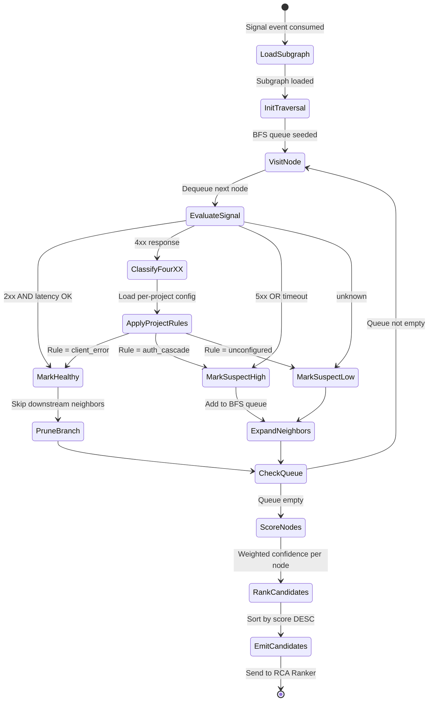

---

## 8. Signal Classification Decision Tree

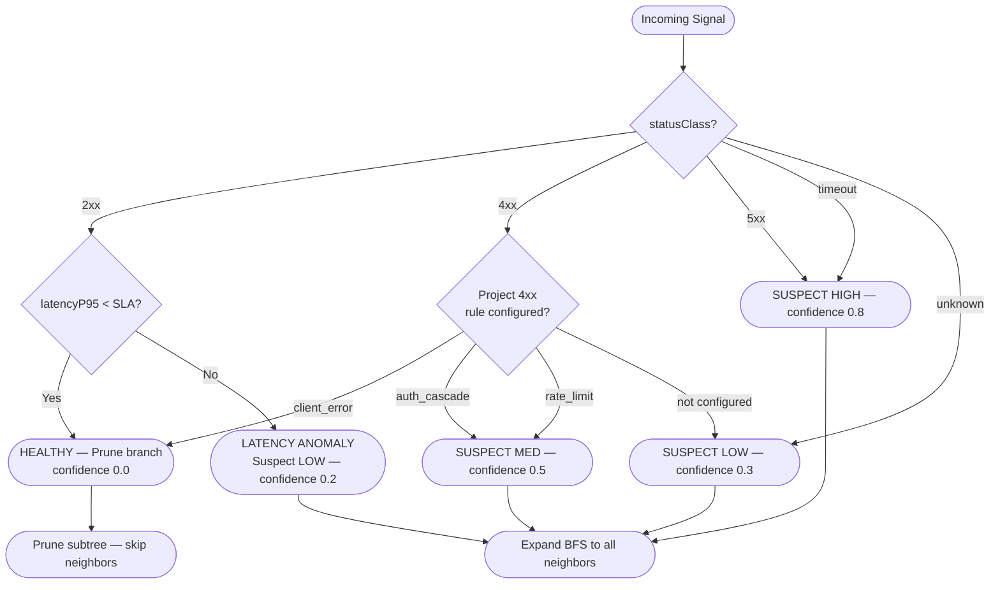

---

## 9. Root Cause Scoring Model

```
Score = 0.40 x DirectSignal
      + 0.25 x SharedDownstreamImpact
      + 0.20 x BranchIsolation
      + 0.10 x LatencyAnomaly
      + 0.05 x RecentDeploymentFlag
```

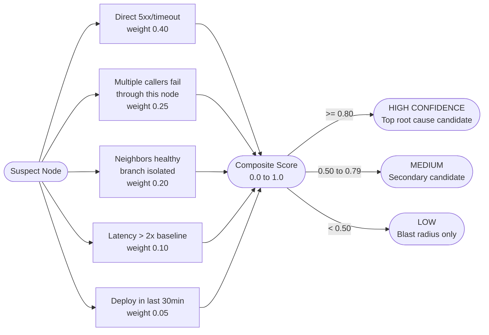

---

## 10. Operator Workflow — End-to-End

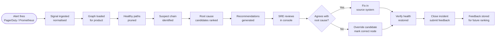

---

## 11. Data Model — Entity Relationships

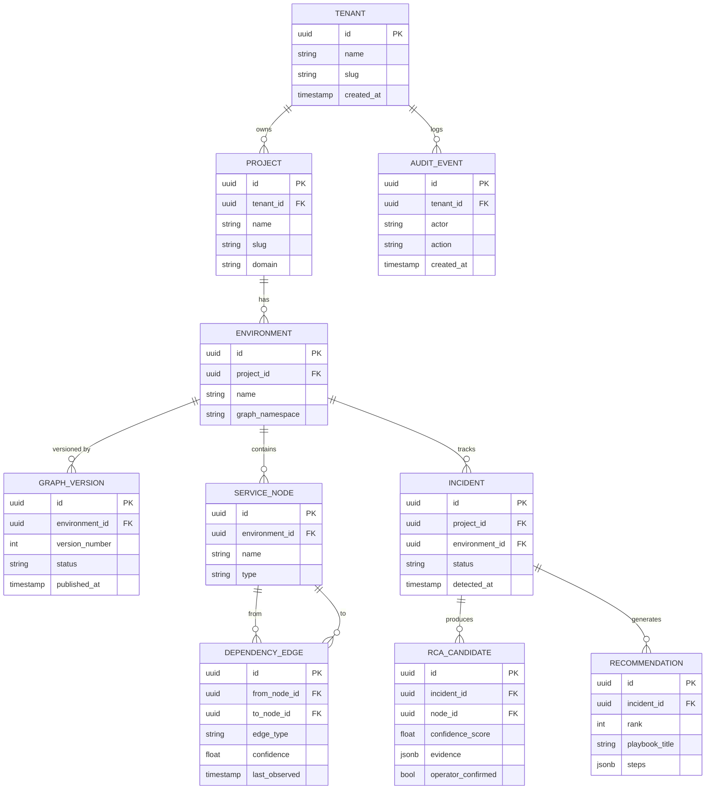

---

## 12. Service Communication Map

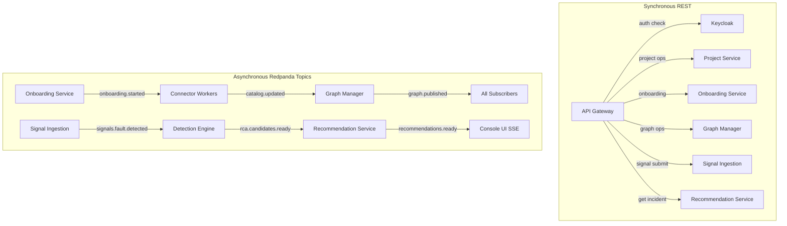

---

## 13. Kubernetes Deployment

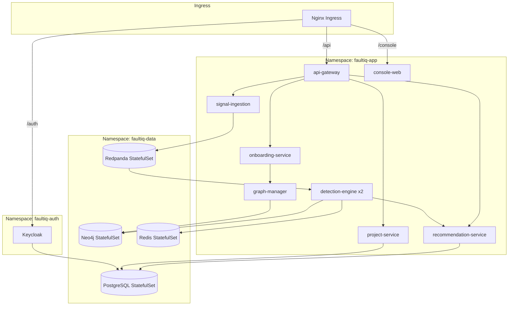

---

## 14. Security Architecture

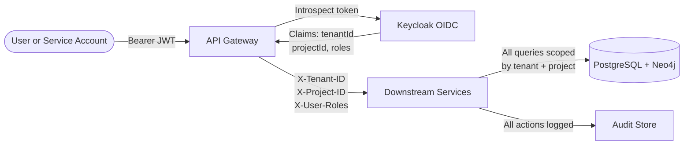

### RBAC Roles

| Role | Scope | Permissions |
|---|---|---|
| `tenant:admin` | Tenant-wide | Create projects, manage members, view all |
| `project:admin` | Project | Onboard product, manage graph, view incidents |
| `project:analyst` | Project | Analyze incidents, view graph, submit feedback |
| `project:viewer` | Project | Read-only incidents and recommendations |
| `signal:publisher` | Project | Ingest signals only — monitoring accounts |

---

## 15. Architecture Decision Records

### ADR-001 — Single Language: Go

**Status**: Accepted
**Decision**: Go for all backend services.
**Why**: 15-day deadline. All-Go saves 9.5 dev-days vs polyglot (Java + Python + Go). Single toolchain. Shared types package. Goroutines handle all concurrency natively.
**Tradeoff**: Python connector ecosystem skipped in MVP. Real connectors added post-demo.

---

### ADR-002 — Graph DB: Neo4j Community (GPL-3)

**Status**: Accepted
**Decision**: Neo4j Community over Memgraph or FalkorDB.
**Why**: Disk-native — handles larger-than-RAM graphs. Deep hop traversal (up to 6 hops) is stable. Memgraph has documented working-memory explosion at deep hops. FalkorDB benchmarks are vendor-published.
**Tradeoff**: No clustering in Community. Single node until paid tier or ArangoDB migration.

---

### ADR-003 — Messaging: Redpanda

**Status**: Accepted
**Decision**: Redpanda over Apache Kafka.
**Why**: Sub-1ms p99 latency. No ZooKeeper. Single binary. Full Kafka API compatibility — zero client code changes.
**Tradeoff**: Smaller community than Kafka at extreme throughput.

---

### ADR-004 — Auth: Keycloak

**Status**: Accepted
**Decision**: Keycloak (Apache 2.0) self-hosted via Helm.
**Why**: Zero per-user cost. Full control over realms and RBAC. Official K8s Helm chart. PostgreSQL backend — same data plane.
**Tradeoff**: Operator manages Keycloak infra vs zero-burden Okta SaaS.

---

### ADR-005 — MVP: Detection + Recommendation Only

**Status**: Accepted
**Decision**: No auto-remediation in MVP.
**Why**: Safer rollout. Operators retain control. Cleaner patent story around recommendation as a distinct decoupled mechanism.
**Tradeoff**: Full loop automation deferred to post-MVP.
