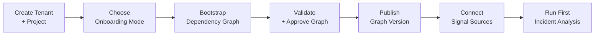
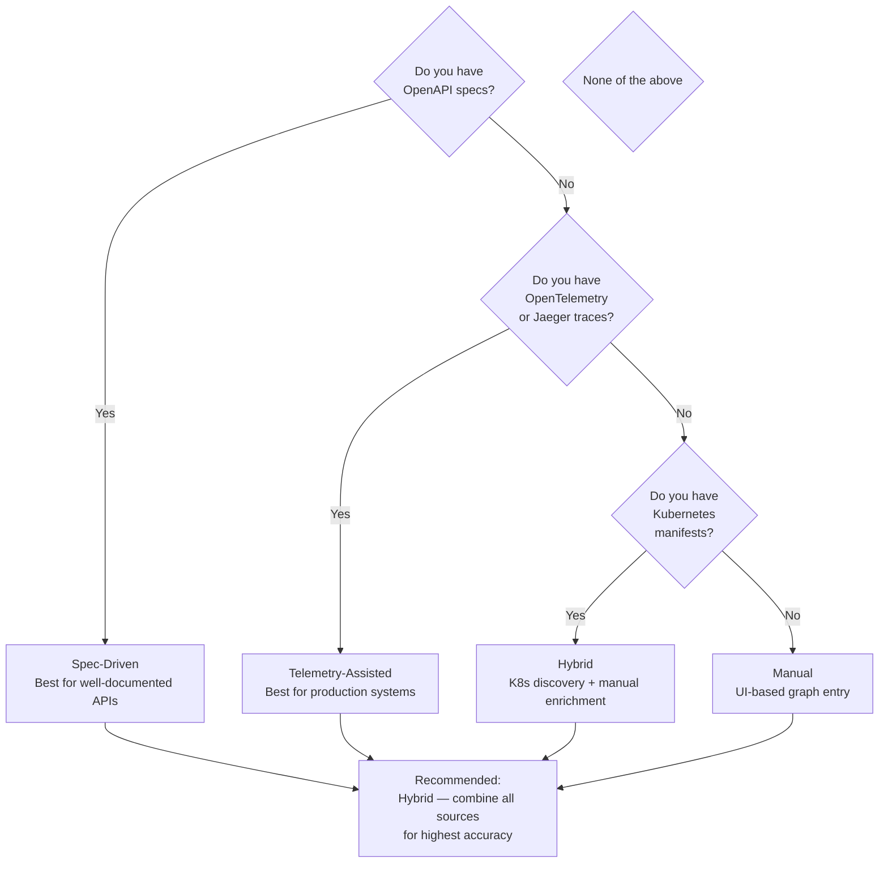
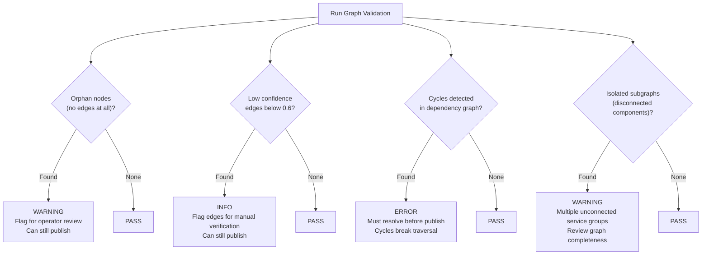
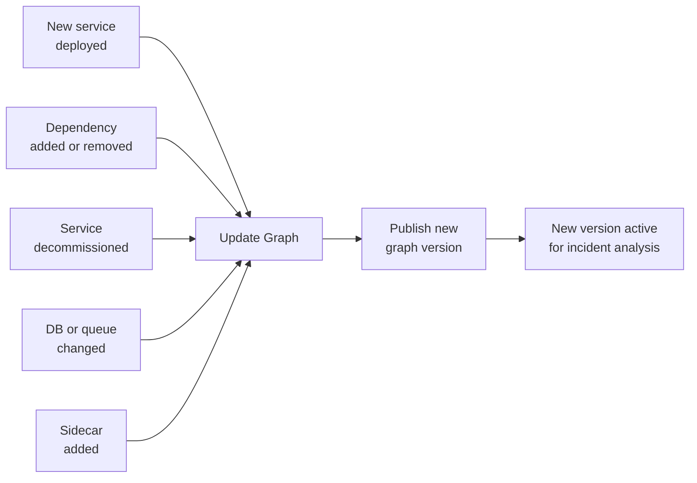

# FaultIQ — Product Onboarding Guide

> This guide covers everything needed to onboard a new product (project) into FaultIQ —
> from creating the tenant and project, to building the dependency graph, validating it,
> and running the first incident analysis.

---

## Overview

Onboarding a product into FaultIQ means giving the platform a map of how your services
talk to each other. This map is the **Detection Graph**. Without an accurate graph,
root cause analysis will be wrong — garbage in, garbage out.



Total time for a 20-service product using hybrid mode: **30–60 minutes**

---

## Step 1 — Create Tenant and Project

### 1.1 Create Tenant

Only done once. Skip if your tenant already exists.

```http
POST /api/v1/tenants
Authorization: Bearer <superadmin-token>

{
  "name": "Acme Corp",
  "slug": "acme-corp",
  "plan": "pro"
}
```

Save the returned `tenantId` — you need it for all subsequent calls.

---

### 1.2 Create Project

Each product you want to monitor is a **project**. A project has one or more environments.

```http
POST /api/v1/tenants/{tenantId}/projects
Authorization: Bearer <token>

{
  "name": "Payments Platform",
  "slug": "payments-platform",
  "domain": "payments",
  "environments": ["dev", "stage", "prod"]
}
```

Each environment gets its own isolated graph namespace:
- `payments-platform:dev`
- `payments-platform:stage`
- `payments-platform:prod`

Graphs are independent per environment. A prod outage does not affect the dev graph.

---

## Step 2 — Choose Onboarding Mode

FaultIQ supports four onboarding modes. Pick based on what you have available.



| Mode | Sources | Accuracy | Time |
|---|---|---|---|
| **Spec-Driven** | OpenAPI, AsyncAPI, service registry | High for documented services | 10–15 min |
| **Telemetry-Assisted** | OTel traces, Jaeger, Zipkin | High for production traffic | 15–20 min |
| **Hybrid (Recommended)** | All sources combined | Highest | 20–30 min |
| **Manual** | UI node/edge entry | Depends on operator knowledge | 30–60 min |

---

## Step 3 — Bootstrap the Graph

### 3.1 Hybrid Mode (Recommended)

```http
POST /api/v1/projects/{projectId}/onboarding/import
Authorization: Bearer <token>

{
  "environment": "prod",
  "mode": "hybrid",
  "sources": {
    "openapi": [
      "s3://your-bucket/specs/payment-api.yaml",
      "s3://your-bucket/specs/ledger-api.yaml"
    ],
    "kubernetes": true,
    "traces": true,
    "gatewayLogs": false
  }
}
```

This triggers the onboarding pipeline:

```mermaid
sequenceDiagram
    participant ONB as Onboarding Service
    participant CONN as Connector Workers
    participant CAT as Service Catalog
    participant GM as Graph Manager
    participant NEO as Neo4j
    participant VAL as Validator

    ONB->>CONN: Pull OpenAPI specs
    ONB->>CONN: Pull Kubernetes service list
    ONB->>CONN: Pull OTel trace spans (last 24h)

    CONN->>CONN: Normalize all sources to
canonical ServiceNode + DependencyEdge

    CONN->>CAT: Merge and deduplicate nodes
    CAT->>CAT: Assign confidence scores
- OpenAPI spec: 0.95
- Trace observed: 0.85
- K8s inferred: 0.70
    CAT->>GM: Submit graph draft

    GM->>NEO: Write nodes + edges
status=DRAFT namespace=payments:prod
    GM->>VAL: Trigger validation
    VAL-->>ONB: Validation report
```

### 3.2 Manual Mode

Use the console UI or API to add nodes and edges directly.

**Add a service node:**
```http
PUT /api/v1/projects/{projectId}/graphs/nodes
Authorization: Bearer <token>

{
  "environment": "prod",
  "node": {
    "id": "svc_ledger",
    "name": "ledger-service",
    "type": "SERVICE",
    "tags": ["financial", "core"],
    "slaThresholdMs": 500
  }
}
```

**Supported node types:**

| Type | Examples |
|---|---|
| `SERVICE` | Go/Java/Python microservice, API |
| `DATABASE` | PostgreSQL, MySQL, MongoDB, Redis |
| `QUEUE` | Redpanda, Kafka, RabbitMQ topic |
| `EXTERNAL` | Third-party API, payment gateway, SMS provider |
| `GATEWAY` | API gateway, load balancer, ingress |
| `SIDECAR` | Envoy proxy, Istio sidecar, log agent |

**Add a dependency edge:**
```http
PUT /api/v1/projects/{projectId}/graphs/edges
Authorization: Bearer <token>

{
  "environment": "prod",
  "edge": {
    "from": "svc_payment_api",
    "to": "svc_ledger",
    "type": "CALLS",
    "confidence": 0.95,
    "metadata": {
      "protocol": "HTTP",
      "method": "POST",
      "path": "/entries",
      "critical": true
    }
  }
}
```

**Supported edge types:**

| Type | Meaning |
|---|---|
| `CALLS` | Synchronous HTTP/gRPC call |
| `DEPENDS_ON` | Hard dependency (DB, cache) |
| `PUBLISHES_TO` | Async publish to queue/topic |
| `CONSUMES_FROM` | Async consume from queue/topic |
| `PROXIED_BY` | Traffic routed through gateway/sidecar |

---

## Step 4 — Validate the Graph

After bootstrap, the validator checks the graph before it can be published.

### Check job status

```http
GET /api/v1/projects/{projectId}/onboarding/jobs/{jobId}
Authorization: Bearer <token>
```

**Response when validation issues exist:**
```json
{
  "status": "VALIDATION_PENDING",
  "validation": {
    "orphanNodes": 1,
    "lowConfidenceEdges": 3,
    "missingEdges": 0,
    "cycles": 0
  },
  "issues": [
    {
      "type": "ORPHAN_NODE",
      "severity": "WARNING",
      "nodeId": "svc_notification",
      "message": "notification-service has no incoming or outgoing edges"
    },
    {
      "type": "LOW_CONFIDENCE_EDGE",
      "severity": "INFO",
      "edgeId": "edge_07",
      "from": "svc_settlement_worker",
      "to": "svc_ledger",
      "confidence": 0.55,
      "message": "Edge inferred from traces only — consider verifying manually"
    }
  ]
}
```

### Validation rules



| Issue Type | Severity | Blocks Publish? |
|---|---|---|
| `ORPHAN_NODE` | WARNING | No |
| `LOW_CONFIDENCE_EDGE` | INFO | No |
| `CYCLE_DETECTED` | ERROR | Yes — must fix |
| `ISOLATED_SUBGRAPH` | WARNING | No |
| `MISSING_ENTRY_NODE` | ERROR | Yes — must fix |

---

## Step 5 — Review and Approve Graph

Open the graph in the console:

1. Navigate to **Project → Environments → prod → Graph**
2. Review the visual dependency map
3. Fix any WARNING or ERROR items
4. Confirm the graph looks correct for your product

**Common fixes:**

**Orphan node** — Connect it or delete it:
```http
DELETE /api/v1/projects/{projectId}/graphs/nodes/{nodeId}?environment=prod
Authorization: Bearer <token>
```

**Wrong edge direction** — Delete and re-add:
```http
DELETE /api/v1/projects/{projectId}/graphs/edges/{edgeId}?environment=prod
Authorization: Bearer <token>
```

**Low confidence edge** — Manually confirm it:
```http
PATCH /api/v1/projects/{projectId}/graphs/edges/{edgeId}
Authorization: Bearer <token>

{
  "environment": "prod",
  "confidence": 0.95,
  "confirmedManually": true
}
```

---

## Step 6 — Publish Graph Version

Once validated and approved, publish to make the graph active for incident analysis.

```http
POST /api/v1/projects/{projectId}/graphs/publish
Authorization: Bearer <token>

{
  "environment": "prod",
  "notes": "Initial graph for payments-platform prod — 12 services, 18 edges"
}
```

**Response:**
```json
{
  "version": 1,
  "status": "PUBLISHED",
  "namespace": "payments-platform:prod",
  "nodeCount": 12,
  "edgeCount": 18,
  "publishedAt": "2026-05-14T00:06:00Z"
}
```

The graph is now live. Incident analysis will use this version until a new version is published.

---

## Step 7 — Connect Signal Sources

FaultIQ needs live response signals to traverse the graph. Connect at least one source.

### Option A — Prometheus Alertmanager (Recommended)

Add this receiver to your `alertmanager.yml`:

```yaml
receivers:
  - name: faultiq-webhook
    webhook_configs:
      - url: http://faultiq:8083/api/v1/signals
        http_config:
          authorization:
            credentials: <your-signal-publisher-token>
        send_resolved: false

route:
  receiver: faultiq-webhook
  group_by: [service]
  group_wait: 10s
  repeat_interval: 5m
```

Create the signal publisher token in Keycloak with role `signal:publisher` scoped to your project.

---

### Option B — Manual Signal Submission

Send signals directly via the API — useful for demos or custom integrations:

```http
POST /api/v1/signals
Authorization: Bearer <signal-publisher-token>

{
  "tenantId": "t_01HZ9MXK",
  "projectId": "p_02KA1NYL",
  "environment": "prod",
  "signals": [
    { "service": "ledger-service", "statusClass": "timeout",  "errorRate": 0.42, "latencyP95": 4800 },
    { "service": "payment-api",    "statusClass": "5xx",      "errorRate": 0.18, "latencyP95": 1200 },
    { "service": "auth-service",   "statusClass": "2xx",      "errorRate": 0.001,"latencyP95": 38 }
  ],
  "source": "manual"
}
```

---

### Option C — Grafana Alert Webhook

In Grafana, create a contact point of type **Webhook**:
- URL: `http://faultiq:8083/api/v1/signals`
- HTTP Method: POST
- Authorization Header: `Bearer <signal-publisher-token>`

Map Grafana alert labels:
- `service` label → `service` field in signal
- `severity=critical` → `statusClass: 5xx`
- `severity=warning` → `statusClass: timeout`

---

## Step 8 — Run First Incident Analysis

### Via signal (automatic)

Once a signal arrives and is queued to Redpanda, the detection engine picks it up automatically.
Check the console under **Project → Incidents** for the result.

### Via API (manual trigger)

```http
POST /api/v1/projects/{projectId}/incidents/analyze
Authorization: Bearer <token>

{
  "environment": "prod",
  "entryService": "api-gateway",
  "timeWindowMin": 5,
  "signals": [
    { "service": "ledger-service", "statusClass": "timeout",  "errorRate": 0.42, "latencyP95": 4800 },
    { "service": "payment-api",    "statusClass": "5xx",      "errorRate": 0.18, "latencyP95": 1200 },
    { "service": "auth-service",   "statusClass": "2xx",      "errorRate": 0.001,"latencyP95": 38 }
  ]
}
```

You will get back root cause candidates, pruned services, blast radius, and ranked recommendations.
See `api.md` for the full response shape.

---

## Keeping the Graph Current

The graph goes stale after deployments, refactors, or infrastructure changes.
A stale graph produces wrong root cause analysis.

### Graph update triggers



### Recommended update workflow

1. On every deployment → trigger `/onboarding/import` in CI pipeline with `mode: hybrid`
2. Review the diff between the new draft and the current published graph in the console
3. Approve and publish if the diff looks correct
4. If auto-discovery is noisy, use manual confirmation for edges above confidence 0.7

### CI/CD integration example

```yaml
# .github/workflows/deploy.yml
- name: Notify FaultIQ graph refresh
  run: |
    curl -X POST http://faultiq:8082/api/v1/projects/$PROJECT_ID/onboarding/import       -H "Authorization: Bearer $FAULTIQ_TOKEN"       -H "Content-Type: application/json"       -d '{
        "environment": "prod",
        "mode": "hybrid",
        "sources": { "kubernetes": true, "traces": true }
      }'
```

---

## Common Onboarding Issues

| Issue | Cause | Fix |
|---|---|---|
| `CYCLE_DETECTED` error | Circular dependency in graph | Review and remove the circular edge — often a misconfigured sidecar proxy or bidirectional call that should be modelled as two separate edges |
| `MISSING_ENTRY_NODE` error | No node tagged as entry point | At least one node must have tag `entry-point` — typically your API gateway or public-facing service |
| Many low confidence edges | Only traces available, no spec | Add OpenAPI specs or manually confirm edges above 0.6 confidence |
| Orphan nodes everywhere | Service discovery pulled infra nodes not relevant to fault paths | Delete infra-only nodes or add tag `exclude-from-traversal` |
| Graph shows wrong dependencies | Traces captured during low-traffic window | Re-run telemetry connector after peak traffic period |
| Signals arrive but no incident created | Signal publisher token scoped to wrong project | Re-issue token with correct `projectId` claim in Keycloak |

---

## Onboarding Checklist

```
Before onboarding:
  [ ] Tenant created
  [ ] Project and environments created
  [ ] Signal publisher token issued in Keycloak

Graph bootstrap:
  [ ] Onboarding import job triggered
  [ ] All services present as nodes
  [ ] All critical dependencies present as edges
  [ ] At least one entry-point node tagged
  [ ] No CYCLE_DETECTED errors
  [ ] No MISSING_ENTRY_NODE errors
  [ ] Low confidence edges reviewed
  [ ] Orphan nodes resolved or deleted

Before publishing:
  [ ] Visual review of graph in console
  [ ] At least one team member has approved
  [ ] Graph version notes filled in

After publishing:
  [ ] Signal source connected (Prometheus / Grafana / manual)
  [ ] Test signal submitted and incident created
  [ ] First analysis result reviewed
  [ ] CI pipeline updated to trigger graph refresh on deploy
```
